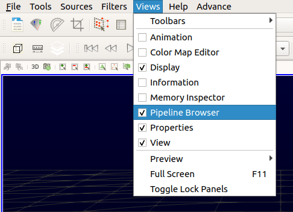
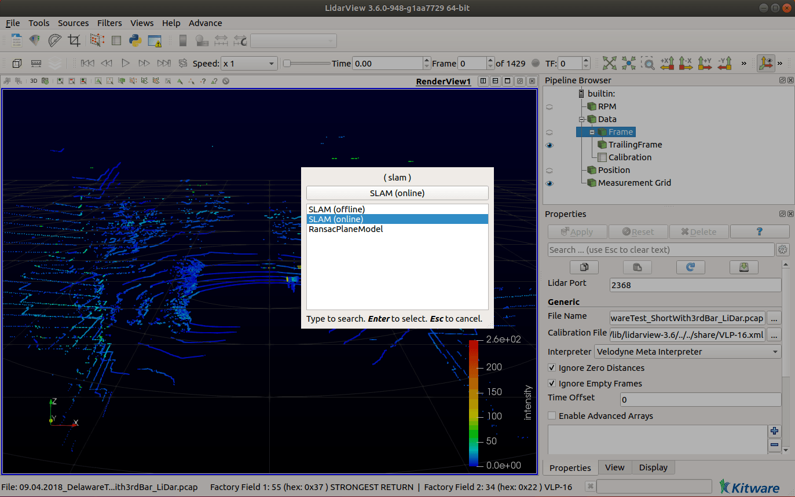
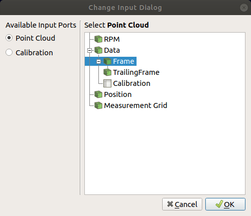
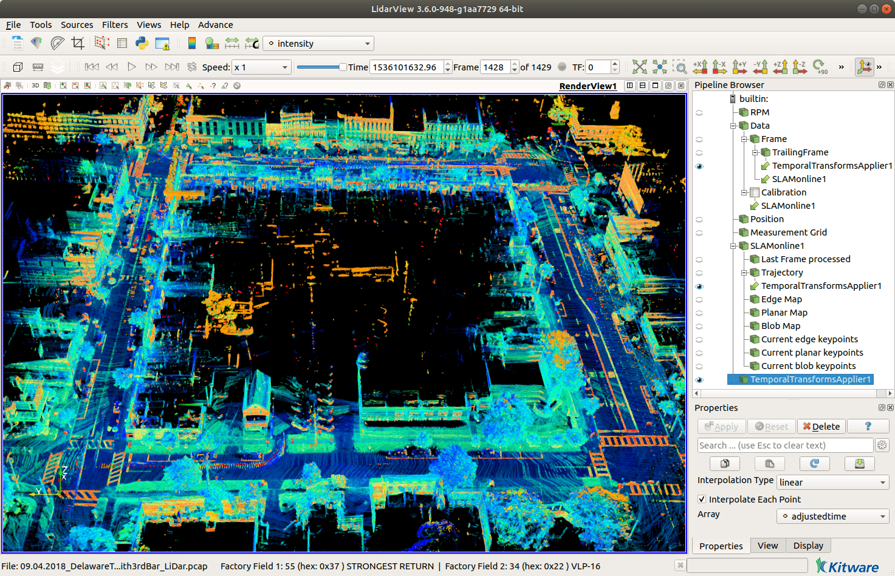

# How to SLAM with LidarView ?

  - [Installing LidarView or one of its derivative with SLAM support](#installing-lidarview-or-one-of-its-derivative-with-slam-support)
  - [Using SLAM in LidarView](#using-slam-in-lidarview)
  - [Saving and exporting SLAM outputs](#saving-and-exporting-slam-outputs)
    - [Saving trajectory](#saving-trajectory)
    - [Saving keypoints maps](#saving-keypoints-maps)
    - [Saving aggregated frames](#saving-aggregated-frames)
  - [SLAM parameters tuning](#slam-parameters-tuning)

This document presents some tips on how to use SLAM algorithm in LidarView, or one of its derived distribution. Even if this SLAM is embedded in a Paraview plugin and is therefore directly usable in Paraview, we will focus on its use in LidarView (as we consider here LiDAR data, LidarView  seems a better choice for most use-cases and display).

Since 2020, this SLAM plugin is natively included and available in LidarView.

## Installing LidarView or one of its derivative with SLAM support

Follow [LidarView's Developer Guide](https://gitlab.kitware.com/LidarView/lidarview-core/-/blob/master/Documentation/LidarView_Developer_Guide.md) instructions to build LidarView on Windows or Linux from source.

*__IMPORTANT__: to enable SLAM support, ensure  your CMake configuration has these options set to `True` :*
```
-DENABLE_ceres=True
-DENABLE_nanoflann=True
-DENABLE_pcl=True
-DENABLE_slam=True 
```

`LidarSlamPlugin` should be automatically loaded at LidarView's startup. If not, ensure **Advanced features** are enabled in **Help** tab, then select **Tools** > **Manage Plugins** > **Load New**. Browse to your LidarView install directory and select the `libLidarSlamPlugin.so` (this file can normally be found under `<lidarview_superbuild_dir>/install/lib/lidarview-3.6/plugins/libLidarSlamPlugin.so`).

## Using SLAM in LidarView

LidarView's SLAM has been tested on `.pcap` files aquired from different LiDAR sensors including :
- Velodyne VLP-16
- Velodyne VLP-32c
- Velodyne HDL-32
- Velodyne HDL-64
- Velodyne VLS-128

1. Open LidarView. Make sure **Advanced Features** are enabled in **Help** tab.

    

2. Under **Views** tab, enable **Pipeline Browser** and **Properties**. 

    

3. Open a previously recorded `.pcap` file (or set up a stream source) associated with its LiDAR calibration file.

4. In **Pipeline browser**, select **Frame** (the pointcloud source). Then click on **Filters** tab > **Alphabetical** > **SLAM**.
   
   *__Tip__ : After having selected __Frame__ , you can also hit `Ctrl+space` and then type `slam` in filter search bar.*

    

5. Hit `Enter` to select a SLAM filter: pick **SLAM (online)** to perform a real-time test with live display, or **SLAM (offline)** for a full process, displaying only final trajectory and maps.

6. A new input dialog will appear :
   - Click on the **Point Cloud** input port, select the **Frame** entry. 
   - Click on the **Calibration** input port, select the **Calibration** entry. 
   - Hit **OK** when done.
 
    

7. Under **Properties** panel, modify the parameters if needed (see section [SLAM parameters tuning](#slam-parameters-tuning)), then hit **Apply**.
   - If you chose online SLAM, a white frame will appear. Hit play button to play back data through the entire recording and watch it SLAM in real time.
   - If you chose offline SLAM, nothing new will show up after you hit **Apply**, but that's normal : the computer is working hard to run SLAM on all frames. When the processing is done, it will display its results.

## Saving and exporting SLAM outputs

### Saving trajectory

Once SLAM is complete, you can export the Trajectory (for example as as `.poses` file) to avoid running the SLAM again. To save it, select in the **Pipeline Browser** panel the **Trajectory** output, then hit `Ctrl+s` (or **Advance** tab > **File** > **Save Data**), and choose the output format and name in the dialog window. Later, to load the trajectory back in LidarView, you can drag and drop the `.poses` file.

### Saving keypoints maps

To save SLAM keypoints maps, select the map output you want to save in the **Pipeline Browser** panel, then hit `Ctrl+s` (or **Advance** tab > **File** > **Save Data**), and choose the output format and name in the dialog window. Common pointclouds formats are `csv`, `pcd`, `las`, `ply` or `vtp`.

### Saving aggregated frames

To export processed frames as a single aggregated pointcloud, you need to instanciate a **Transforms Applier** filter to aggregate all frames using the computed trajectory (sensor path estimated by SLAM):
1. Select the **Trailing frame** entry and set the desired number of trailing frames (0 meaning only the last frame, and, for example, 10 displaying the current frame and the 10 previous ones). Click on **Apply**. You should now see all the frames aggregated in a non-sense way (all points being displayed using their coordinates relative to the sensor at the time of acquisition).
2. Instantiate a **Temporal Transform Applier** filter using the Trailing Frame as point cloud entry, and the output SLAM trajectory for trajectory entry. Depending on the number of trailing frames, the transformation and aggregation of pointclouds may be long. When it succeeds, you should now see all points being correctly registered. If the colors look strange, check that you are displaying the `intensity` array in the main toolbar.
3. As usual, save aggregated frames by selecting the desired output **Temporal Transform Applier**,  hit `Ctrl+s`, and choose the output format and name.



## SLAM parameters tuning

The default SLAM parameters are a good compromise to run the SLAM in outdoor urban area, indoor scene and poor geometric scene (forest recorded from UAV, glades, career, ...). However, the parameters can be adapted to the specific kind of environment you want to process to have an optimal result. Especially, consider tuning these parameters first :

+ ***General parameters***
   - **Number of threads** : maximum number of threads used for parallel processing. Allowing several threads (about 4) increase SLAM processing speed, skipping less frames, and thus improving result.
   - **Undistortion mode** : undistortion greatly improves precision if correctly performed. This implementation makes the assumption that motion is continuous and approximately constant. If this is not true (especially for high-frequency moving plateforms such as UAVs) or experiencing noisy jumps, consider turning it OFF.
   - **Ego-Motion mode** : current frame registration on environment map needs a good optimization initialization to converge. This initialization is done by estimating ego-motion since last frame. Default mode uses continuous and approximately constant speed motion hypothesis to interpolate new pose. If these assumptions are not true, try registration of current frame on previous frame.
   - **Fast SLAM** : SLAM uses by default only edges and planes keypoints. However, if scene presents a poor geometric environment, results could be badly impacted. In this case, consider disabling *Fast Slam* option to allow the use of blobs keypoints.

+ ***Maps parameters***
  - **Edges/Planes/Blobs map resolution** : SLAM maps are voxelized to reduce memory consumption and problem dimensionality to keep at most one point in each cube of a given size. Default resolution (30 cm for edges or blobs keypoints, 60 cm for planes) is good for outdoor structured environments, but a more precise resolution may help in indoor or short-range scenes.

+ ***Spinning sensor keypoints extractor parameters***
  - **Neighborhood width** : it can be useful to lower [increase] this number if you want more high level [local] features. Typically, a higher value may benefit to a high azimuthal resolution sensor (remember also to set **Azimutal angle resolution** according to your sensor specifications).
  - **Minimum distance to sensor** : points closer to the sensor than this distance are ignored. In an indoor scene or with a man-held LiDAR, this parameter may typically need a smaller value.
